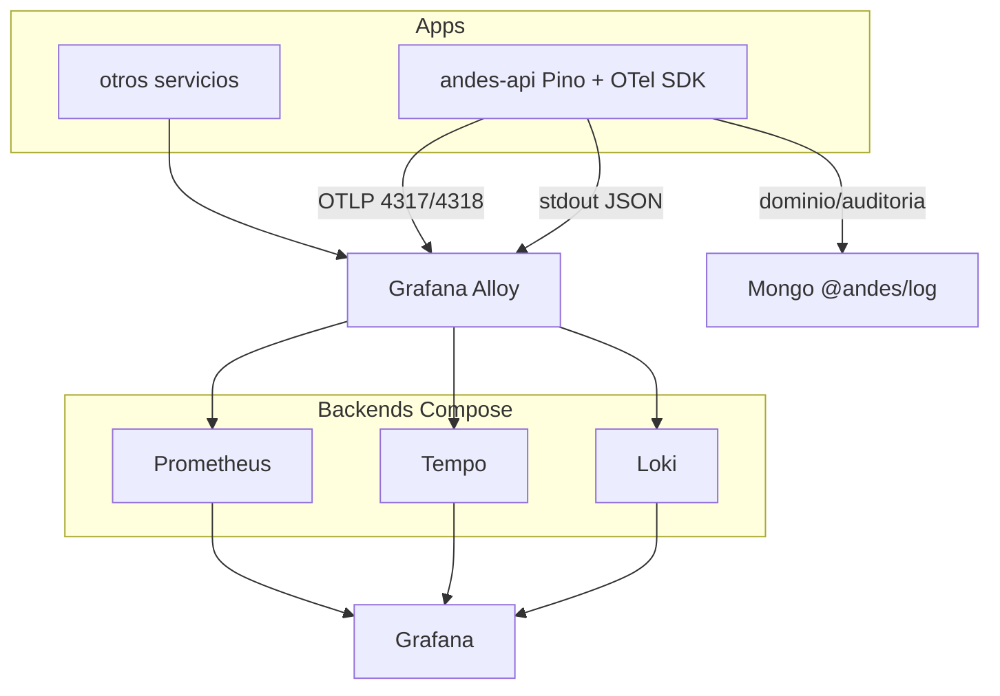

# Observabilidad OTel-ready (Alloy + LGTM)

Stack de observabilidad OTel-ready con Grafana Alloy + Loki + Tempo + Prometheus. Mismo Compose para laptop / test / prod en VMs Ubuntu. Pino operacional en Andes (`module` como campo JSON, no label Loki); `@andes/log` → Mongo se mantiene.

## Decisiones cerradas

- **Collector:** Grafana Alloy (no Promtail).
- **Backends base:** Loki + Tempo + Prometheus + Grafana (LGTM ligero). No solo Grafana+Loki.
- **Deploy:** Docker Compose en laptop (dev) y VMs Ubuntu (test/prod). Mismo compose, distinto `.env` / overrides.
- **Runtime apps:** recolección solo vía **Docker stdout + OTLP** (sin path de archivos / PM2).
- **Andes logger operacional:** **Pino**. `@andes/log` → Mongo se mantiene para dominio/auditoría.
- **Monolito:** `service.name=andes-api`; `module` (rup, turnos, …) va en el **cuerpo** del log, no como label de Loki.

## Qué agregar además de Grafana + Loki

Para sentar bases OTel hacen falta **tres señales**. Solo logs deja a medias traces/metrics y la correlación.

| Pieza | Rol | ¿Obligatorio ya? |
|---|---|---|
| **Grafana Alloy** | Hub: tail logs + recibe OTLP + enruta | Sí |
| **Loki** | Storage logs | Sí |
| **Tempo** | Storage traces | Sí (bases OTel) |
| **Prometheus** | Storage metrics (Compose single-node alcanza en laptop/test/prod chico) | Sí (bases OTel) |
| **Grafana** | UI + alertas | Sí |
| Mimir / Pyroscope | Metrics escala / profiling | No (después) |

Elastic APM (`../api/apm.ts`) puede seguir en paralelo un tiempo; el objetivo es que apps nuevas y Andes empiecen a hablar **OTLP → Alloy**, no APM directo.



## Entornos (mismo stack, distinto sizing)

| Entorno | Dónde | Compose | Notas |
|---|---|---|---|
| **local** | laptop | `docker compose --profile local up` | Retención corta Loki/Tempo; Grafana anonymous OK; un solo nodo |
| **test** | VM Ubuntu | compose + `.env.test` | Auth Grafana; retención media; endpoints internos |
| **prod** | VM Ubuntu | compose + `.env.prod` | Auth + TLS/reverse proxy; volúmenes persistentes; retención según disco; sin anonymous |

Estructura del repo:

```
observabilidad/
  PLAN.md
  docker-compose.yml          # servicios base
  docker-compose.local.yml    # overrides laptop
  docker-compose.test.yml
  docker-compose.prod.yml
  config/alloy/*.alloy
  config/loki.yml
  config/tempo.yml
  config/prometheus.yml
  grafana/provisioning/...
  .env.example
```

Variables clave por entorno: `ENVIRONMENT`, retención, credenciales Grafana, `OTEL_EXPORTER_OTLP_ENDPOINT=http://alloy:4318`.

Apps (Andes, recetar, …) en la misma red Docker o apuntando al host de la VM; Alloy escucha OTLP y scrapea contenedores con label (ej. `obs.enabled=true`).

## Contrato de logs (monolito Andes)

Labels Loki (baja cardinalidad):

- `service_name` ← `service.name` (ej. `andes-api`)
- `level`
- `deployment_environment` ← `local|test|prod`

Campos en JSON (no labels):

- `module` — `rup`, `turnos`, `mpi`, … (el monolito se filtra acá)
- `action`, `msg`, request ids, errores
- `trace_id`, `span_id`

¿Por qué `module` no es label? En Loki cada combinación de labels es un stream. `module` se filtra bien con LogQL (`| json | module="rup"`). Dejarlo en el cuerpo evita multiplicar streams y que alguien termine metiendo paths libres como label. Si el set queda whitelistado/enum y casi todo el dashboard es por módulo, se puede promover después.

Ejemplo:

```json
{
  "level": "info",
  "time": 1718234567890,
  "service.name": "andes-api",
  "service.instance.id": "andes-api-1",
  "deployment.environment": "test",
  "module": "rup",
  "msg": "prestacion guardada",
  "trace_id": "4bf92f3577b34da6a3ce929d0e0e4736",
  "span_id": "00f067aa0ba902b7"
}
```

Alertas: una regla genérica por `service_name` / métricas RED; no hardcodear `NoLogsAndesApi`, etc.

Uptime: health HTTP + Prometheus; “time since last log” solo como panel auxiliar.

## Logger en Andes: Pino operacional

Agregar Pino como logger operacional; **no** reemplazar `@andes/log`.

| Capa | Herramienta | Destino | Uso |
|---|---|---|---|
| Operacional | **Pino + pino-http** | stdout → Alloy → Loki | requests, errores runtime, jobs |
| Dominio | `@andes/log` (sigue) | Mongo | auditoría / eventos de negocio (laboratorio, turnos, …) |
| Traces/metrics | `@opentelemetry/sdk-*` (fase 2) | OTLP → Alloy | HTTP, Mongo, outbound |

Por qué Pino:

- JSON nativo, bajo costo, estándar de facto en Node; Alloy/Loki lo digieren bien.
- `pino-http` da request logging sin reinventar.
- Bridges a OTel maduros; se puede inyectar `trace_id` desde el start.
- `@andes/log` está pensado para persistencia Mongo + buckets/TTL de dominio — mal fit para logs de alta frecuencia de request.

Cómo encajarlo en el monolito (mínimo invasivo):

1. Factory única tipo `utils/logger.ts`: `pino({ base: { 'service.name': …, 'deployment.environment': … } })`.
2. Child loggers por módulo: `logger.child({ module: 'rup' })`.
3. `app.use(pinoHttp({ logger }))` en el bootstrap Express.
4. Ir reemplazando `debug(...)` / `console` operacionales; **no** tocar los `*Log = new Logger({...})` de dominio en la primera pasada.
5. Cuando entre OTel SDK: middleware que propague contexto y mixín Pino con `trace_id`/`span_id`.

## Pipeline Alloy (target)

**Fase A:**

- `loki.source.docker` → parse JSON → labels → `loki.write`
- OTLP receiver abierto (aunque todavía nadie exporte)

**Fase B:**

- Apps → OTLP → Alloy → Tempo + Prometheus (+ opcional logs OTLP a Loki)
- Mantener tail stdout como red de seguridad

## Roadmap

1. **Stack Compose** Alloy + Loki + Tempo + Prometheus + Grafana; perfiles local/test/prod.
2. **Contrato de log** + provisioning Grafana (3 datasources, dashboard, alertas genéricas).
3. **Andes:** Pino operacional + label Docker `obs.enabled`; verificar en Explore `{service_name="andes-api"}`.
4. **OTel SDK** en Andes (traces HTTP + export OTLP); correlacionar en Grafana Loki↔Tempo.
5. **Métricas RED** + alertas; deprecar panel “solo silencio de logs” como health.

## Backlog

- [ ] Definir docker-compose del stack (Alloy, Loki, Tempo, Prometheus, Grafana) con overlays local/test/prod
- [ ] Pipeline Alloy: Docker SD + OTLP → Loki/Tempo/Prometheus (sin file scrape); labels de baja cardinalidad
- [ ] Contrato JSON OTel-aligned documentado y ejemplificado
- [ ] Introducir Pino operacional en andes-api (factory + pino-http) sin migrar `@andes/log`
- [ ] Provisionar datasources + dashboard base + alertas por `service_name`

## Fuera de scope inicial

- Migrar historial `@andes/log` / Mongo a Loki.
- Mimir / clustering Loki.
- Tirar Elastic APM el día 1 (convivencia OK hasta que Tempo cubra lo necesario).
